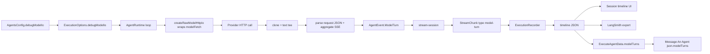

# Agents: model-turn debug IO (`N8N_AGENTS_DEBUG_MODEL_IO`)

Opt-in capture of each **model HTTP** request/response for Session timeline
debug, LangSmith export, and Message An Agent node output.

**Default:** off. Bodies are stored as JSON. Request is the parsed HTTP body.
Response is the **final aggregated completion** (not the raw SSE transcript).
There is no redaction or truncation. Payloads can be large and may contain
secrets present in the request/response.

## Purpose

When enabled, each model HTTP call emits one `model-turn` event with:

- the call URL (as sent)
- parsed request JSON
- final response JSON (SSE deltas aggregated into one completion)

The Session UI shows it on the timeline. Workflow runs also surface the same
records on `ExecuteAgentData.modelTurns` (by design).

## Config

| Item | Value |
| --- | --- |
| Env | `N8N_AGENTS_DEBUG_MODEL_IO` |
| Config field | `AgentsConfig.debugModelIo` (`packages/@n8n/config`) |
| Default | `false` |
| Example | `.env.local.example` |
| Runtime option | `ExecutionOptions.debugModelIo` |
| Helper to spread | `debugModelIoOption(enabled)` in `packages/cli/.../utils/debug-model-io-option.ts` |

Hosts that start agent runs must pass the option when the config flag is true:

- `agent-execution-orchestrator.service.ts` (stream + resume)
- `agent-workflow-execution.service.ts`
- `sub-agents/sub-agent-runner.ts`

## Data flow



1. When `debugModelIo` is set, the runtime wraps `modelFetch` with
   `createRawModelHttpIo` before `createModel`.
2. After each `callModel` (including empty-turn retries), the runtime flushes
   teed bodies and emits one `AgentEvent.ModelTurn` per HTTP call.
3. `stream-session` bridges the event into a `model-turn` stream chunk.
4. `ExecutionRecorder` persists the JSON bodies on the timeline (no scrub).
5. Consumers read the timeline: Session UI, LangSmith export, workflow node
   output.

Auth headers are never recorded. Query strings on the URL are kept as sent.

## Payload contract

Canonical type: `ModelTurnDebugPayload` in
`packages/@n8n/agents/src/types/runtime/model-turn-debug.ts`.

Reuse this type wherever possible:

- `AgentEvent.ModelTurn` = `{ type } & ModelTurnDebugPayload`
- `StreamChunk` `model-turn` = `{ type: 'model-turn' } & ModelTurnDebugPayload`
- `TimelineEvent` model-turn branch = `{ type: 'model-turn' } & ModelTurnDebugPayload`

`ExecuteAgentData.modelTurns` in `n8n-workflow` mirrors the same fields (cannot
import `@n8n/agents`; keep in sync by hand when the payload shape changes).

| Field | Notes |
| --- | --- |
| `turnIndex` | 0-based loop iteration |
| `timestamp` / `endTime` | HTTP call wall clock (ms) |
| `model` / `finishReason` / `usage` | Optional loop metadata |
| `emptyRetries` | Empty-turn retries before this HTTP call; omit when 0 |
| `url` / `method` / `status` / `streamed` | HTTP metadata |
| `requestBody` | Parsed request JSON (or raw text if not JSON) |
| `responseBody` | Final aggregated completion JSON — **not** the SSE log |
| `error` | Present when the fetch itself failed |

### Capture rules (`model-turn-debug.ts`)

- Intercept at `fetch`, not the AI SDK message layer.
- Tee `response.clone().text()` so the live consumer is unaffected.
- Parse request body with `JSON.parse` when possible.
- For SSE (`text/event-stream`):
  - OpenAI-compatible chunks → one `chat.completion`-shaped object
    (concatenated `content` / `reasoning_content`, merged `tool_calls`, usage)
  - Anthropic `message_*` events → one final message object
- For non-SSE JSON responses: parse as JSON.
- Do **not** store the raw SSE transcript as `responseBody`.
- Do **not** store request/response headers (avoids leaking `Authorization`).

## UI behaviour

- Kind: `model-turn` (filter chip, pill colour orange, icon `brain`).
- Display index: `turnIndex + 1` (1-based labels).
- Chart: treat as a point event (`INSTANT_MS`); keep `endTimestamp` for popover
  duration.
- Detail panel: URL / HTTP metadata + Request / Response as JSON code blocks
  (`language="json"` via `stringifyJson`).
- Search: includes model name, display turn index, URL, request, response.
- Builder preview context: summary only (`LLM turn N | model=… | url=…`), never
  dump request/response bodies.

## Locked design decisions

Do not reverse these without an explicit product change:

1. **Full snapshots stay on workflow node output** (`modelTurns` on Message
   An Agent). Session timeline is not the only sink.
2. **Feature is instance-wide env opt-in**, not per-agent UI toggle (current
   scope).
3. **Preview / builder context must not dump raw IO** (summary line only).
4. **Response is the final aggregated result**, not the SSE wire log.
5. **No redaction/truncation** when the flag is on — size and secret risk are
   accepted for debug.

## File map (touch these when changing the feature)

### Add / change payload fields

1. `packages/@n8n/agents/src/types/runtime/model-turn-debug.ts`
2. `packages/@n8n/agents/src/runtime/loop/model-turn-debug.ts` (+ tests)
3. `packages/@n8n/agents/src/runtime/loop/agent-runtime.ts` (wrap + emit)
4. `packages/workflow/src/interfaces.ts` → `ExecuteAgentData.modelTurns`
5. Frontend: `session-timeline.types.ts`, `session-timeline.utils.ts`
   (`RawModelTurnEvent` + flatten + search), `SessionDetailPanel.vue`, i18n
6. `execution-recorder.ts` (pass-through bodies)
7. `agent-session-langsmith-export.service.ts` metadata if needed
8. `agent-workflow-execution.service.ts` → `modelTurnsFromTimeline`

### Add a new consumer of snapshots

- Prefer reading timeline / stream `model-turn` chunks; do not re-call the
  model.
- Wire via recorder or stream consumer; keep capture rules in
  `createRawModelHttpIo` / `finalizeResponseBody` only.

### Enable from a new host path

```ts
import { debugModelIoOption } from './utils/debug-model-io-option';
// ...
...debugModelIoOption(this.agentsConfig.debugModelIo),
```

### Remove the feature

Delete or revert in this order:

1. Runtime wrap/emit + `model-turn-debug.ts` + types + stream-session listener
2. Config env + `debugModelIoOption` + host spreads
3. Recorder / LangSmith / workflow `modelTurns` / Message An Agent
4. Frontend kind + components + i18n + styles
5. Tests and this spec

## Tests (minimum)

| Area | File |
| --- | --- |
| SSE aggregate + JSON parse | `packages/@n8n/agents/.../model-turn-debug.test.ts` |
| Recorder | `execution-recorder.test.ts` |
| Workflow output | `agent-workflow-execution.service.test.ts` |
| LangSmith | `agent-session-langsmith-export.service.test.ts` |
| Preview summary | `format-preview-context.test.ts` |
| Flatten + search | `session-timeline.utils.spec.ts` |
| Message An Agent | `MessageAnAgent.node.test.ts` |
| Config default | `packages/@n8n/config/test/config.test.ts` |

## Local verify

```bash
N8N_AGENTS_DEBUG_MODEL_IO=true N8N_ENABLED_MODULES=agents pnpm dev:be
```

Open a Session with agent runs; timeline Model turn entries should show Request /
Response as JSON. Response must be one final completion object, not SSE lines.
