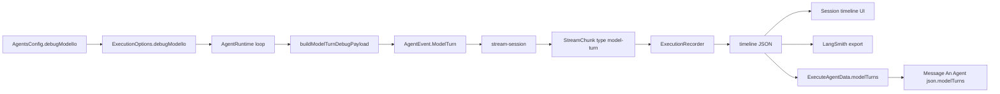

# Agents: model-turn debug IO (`N8N_AGENTS_DEBUG_MODEL_IO`)

Opt-in snapshots of each LLM request/response for Session timeline debug,
LangSmith export, and Message An Agent node output.

**Default:** off. Payloads can be large and may contain sensitive data.

## Purpose

When enabled, each model call emits one `model-turn` event with a size-capped,
JSON-safe snapshot. The Session UI shows it on the timeline. Workflow runs also
surface the same snapshots on `ExecuteAgentData.modelTurns` (by design).

## Config

| Item | Value |
| --- | --- |
| Env | `N8N_AGENTS_DEBUG_MODEL_IO` |
| Config field | `AgentsConfig.debugModelIo` (`packages/@n8n/config`) |
| Default | `false` |
| Example | `.env.local.example` |
| Runtime option | `ExecutionOptions.debugModelIo` |
| Helper to spread | `debugModelIoOption(enabled)` in `packages/cli/.../utils/debug-model-io-option.ts` |

Hosts that start agent runs must pass the option when the config flag is true:

- `agent-execution-orchestrator.service.ts` (stream + resume)
- `agent-workflow-execution.service.ts`
- `sub-agents/sub-agent-runner.ts`

## Data flow



1. Runtime calls the model, then (if `debugModelIo`) builds a payload and emits
   `AgentEvent.ModelTurn`.
2. `stream-session` bridges the event into a `model-turn` stream chunk.
3. `ExecutionRecorder` persists it on the execution timeline (with secret
   scrubbing).
4. Consumers read the timeline: Session UI, LangSmith export, workflow node
   output.

## Payload contract

Canonical type: `ModelTurnDebugPayload` in
`packages/@n8n/agents/src/types/runtime/model-turn-debug.ts`.

Reuse this type wherever possible:

- `AgentEvent.ModelTurn` = `{ type } & ModelTurnDebugPayload`
- `StreamChunk` `model-turn` = `{ type: 'model-turn' } & ModelTurnDebugPayload`
- `TimelineEvent` model-turn branch = `{ type: 'model-turn' } & ModelTurnDebugPayload`

`ExecuteAgentData.modelTurns` in `n8n-workflow` mirrors the same fields (cannot
import `@n8n/agents`; keep in sync by hand when the payload shape changes).

| Field | Notes |
| --- | --- |
| `turnIndex` | 0-based loop iteration |
| `timestamp` / `endTime` | Model call wall clock (ms) |
| `model` / `finishReason` / `usage` | Optional metadata |
| `emptyRetries` | Empty-turn retries discarded before this snapshot; omit when 0 |
| `request.system` / `request.messages` / `request.toolNames` | Redacted + size-capped |
| `response.messages` | Redacted + size-capped |
| `truncated` | True when IO was shrunk or stubbed |

### Snapshot rules (`model-turn-debug.ts`)

- Hard byte budget: `MODEL_TURN_DEBUG_MAX_BYTES` (256 KiB) on the **final**
  payload (metadata + IO).
- File / image / binary parts: replace `data` with `{ type, omitted: true,
  mediaType? }` before JSON clone.
- Oversized text: truncate string fields in steps; if still over budget, stub
  messages to `[]` and set `system: '[omitted]'` (keep `toolNames`).
- One JSON round-trip for safety; then budget checks with UTF-8 byte length.

## UI behaviour

- Kind: `model-turn` (filter chip, pill colour orange, icon `brain`).
- Display index: `turnIndex + 1` (1-based labels).
- Chart: treat as a point event (`INSTANT_MS`); keep `endTimestamp` for popover
  duration.
- Detail panel: metadata + Request/Response JSON code blocks; warn when
  `truncated`.
- Search: includes model name, display turn index, request, response.
- Builder preview context: summary only (`LLM turn N | model=…`), never dump
  request/response bodies.

## Locked design decisions

Do not reverse these without an explicit product change:

1. **Full snapshots stay on workflow node output** (`modelTurns` on Message An
   Agent). Session timeline is not the only sink.
2. **Feature is instance-wide env opt-in**, not per-agent UI toggle (current
   scope).
3. **Preview / builder context must not dump raw IO** (summary line only).

## File map (touch these when changing the feature)

### Add / change payload fields

1. `packages/@n8n/agents/src/types/runtime/model-turn-debug.ts`
2. `packages/@n8n/agents/src/runtime/loop/model-turn-debug.ts` (+ tests)
3. `packages/workflow/src/interfaces.ts` → `ExecuteAgentData.modelTurns`
4. Frontend: `session-timeline.types.ts`, `session-timeline.utils.ts`
   (`RawModelTurnEvent` + flatten + search), `SessionDetailPanel.vue`, i18n
5. `execution-recorder.ts` (usually free if it uses `ModelTurnDebugPayload`)
6. `agent-session-langsmith-export.service.ts` metadata if needed
7. `agent-workflow-execution.service.ts` → `modelTurnsFromTimeline`

### Add a new consumer of snapshots

- Prefer reading timeline / stream `model-turn` chunks; do not re-call the
  model.
- Wire via recorder or stream consumer; keep size/redaction rules in
  `buildModelTurnDebugPayload` only.

### Enable from a new host path

```ts
import { debugModelIoOption } from './utils/debug-model-io-option';
// ...
...debugModelIoOption(this.agentsConfig.debugModelIo),
```

### Remove the feature

Delete or revert in this order:

1. Runtime emit + `model-turn-debug.ts` + types + stream-session listener
2. Config env + `debugModelIoOption` + host spreads
3. Recorder / LangSmith / workflow `modelTurns` / Message An Agent
4. Frontend kind + components + i18n + styles
5. Tests and this spec

## Tests (minimum)

| Area | File |
| --- | --- |
| Snapshot build / omit / hard cap | `packages/@n8n/agents/.../model-turn-debug.test.ts` |
| Recorder | `execution-recorder.test.ts` |
| Workflow output | `agent-workflow-execution.service.test.ts` |
| LangSmith | `agent-session-langsmith-export.service.test.ts` |
| Preview summary | `format-preview-context.test.ts` |
| Flatten + search | `session-timeline.utils.spec.ts` |
| Message An Agent | `MessageAnAgent.node.test.ts` |
| Config default | `packages/@n8n/config/test/config.test.ts` |

Still optional: assert `debugModelIo: true` is passed into `stream()`; Session
detail panel component test.

## Local verify

```bash
N8N_AGENTS_DEBUG_MODEL_IO=true N8N_ENABLED_MODULES=agents pnpm dev:be
```

Open a Session with agent runs; timeline should show Model turn entries with
Request/Response when the flag is on.
