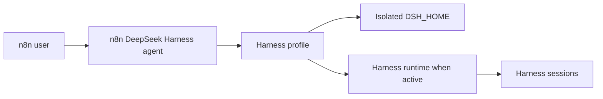

# DeepSeek Harness Integration Specification

## Purpose

This document defines the planned DeepSeek Harness integration in n8n. It records the decisions that are stable today. It also separates implemented behavior from planned behavior.

## Product Model

DeepSeek Harness is a peer to n8n Agents. It is not an n8n workflow node in the first delivery.

One n8n DeepSeek Harness agent owns one isolated Harness profile. The profile is backed by one Harness home directory (`DSH_HOME`) and, when creation is implemented, one `.dsh` configuration scope. The profile holds Harness credentials, settings, plugins, presets, and session data. “Profile” is an internal isolation boundary, not an extra user-facing object.



## Isolation Rules

- A Harness profile has its own `DSH_HOME` directory.
- A runtime can access one profile only.
- Only one runtime can write to one `DSH_HOME` directory at a time.
- Different profiles can run at the same time.
- A stopped runtime does not delete the profile directory.
- n8n must not modify the DeepSeek Harness source code.

These rules prevent settings, credentials, plugins, and sessions from being shared by accident.

## Runtime Model

The future runtime manager starts a Harness runtime only when an agent needs it. It can stop an idle runtime after a configured period. This does not require one permanent container for every agent.

The deployment model can use Docker containers. It can also use isolated processes in a development environment. The runtime contract is the same in both models: one active runtime maps to one profile home directory.

## n8n Environment Configuration

n8n exposes the Harness home root through an environment variable:

```text
N8N_DEEPSEEK_HARNESS_HOME=D:\\n8n-data\\deepseek
```

When the variable is not set, n8n keeps the native Harness default of `~/.dsh`. The future runtime launcher passes the resolved value to the Harness process as `DSH_HOME`. Agent-specific `.dsh` data must remain below this configured root and must not use a user-supplied arbitrary path.

## Configuration UI

The native Harness Studio remains the preferred configuration UI. It is not part of the initial entry-page delivery.

When Studio support is added, n8n opens Studio for the selected profile only. The runtime manager must pass the profile-specific `DSH_HOME` and a scoped Studio access URL. A Studio page must never point to another profile.

## Current Delivery: Entry Page and Environment Configuration

The current delivery contains the frontend entry and the n8n environment configuration. It does not create, store, run, or configure a Harness agent yet.

Implemented behavior:

- Add a `DeepSeek Harness` preview tab after `Agents`.
- Add routes for Overview and project pages.
- Show the Agent-style empty state with an active `Create DeepSeek Harness` action.
- Show the existing Insights summary on the Overview page.
- Show `DeepSeek Harness` in the project-header create menu.
- Keep the action as a no-op until creation is implemented.
- Use `Create DeepSeek Harness` consistently for the header and empty-state actions.
- Read `N8N_DEEPSEEK_HARNESS_HOME`, defaulting to `~/.dsh`.

The entry belongs to the existing `AgentsModule`. This is deliberate. The project header shows custom tabs only for active frontend modules. Reusing the active Agents module makes the entry visible without adding a backend module or database migration.

## Persistence Boundary

The current entry page has no database changes.

When users can create Harness agents, n8n must add a dedicated persistence model. It must not reuse the native `agents` table. The new model must keep the agent identity, project ownership, profile directory identity, lifecycle state, and encrypted connection data separate from native n8n Agent data.

## Non-goals of the Current Delivery

- No DeepSeek Harness source change.
- No Harness container or process startup.
- No Studio launch.
- No database migration.
- No n8n workflow node.
- No user-created Harness agent.

## Open Product Decisions

The following decisions need a separate requirement before implementation:

- The exact agent creation form and fields.
- The runtime-manager deployment service and authentication model.
- The Studio reverse-proxy and scoped access-token design.
- The idle timeout and capacity policy.
- The workflow-node contract for calling a Harness agent.
